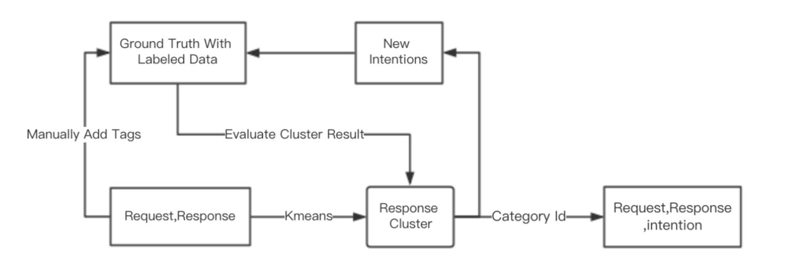
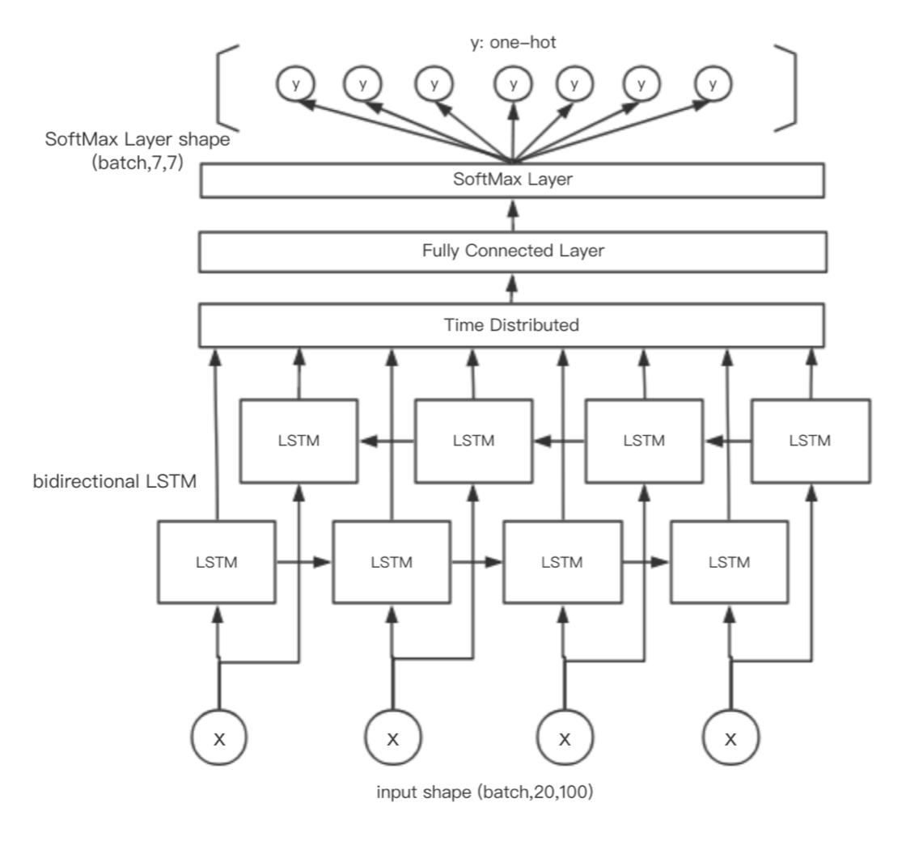

# Intention Classification Of Customer Service Dialog  

User intention classification is a hot topic today, with many kinds of applications like automatic online customer server and various chat-bot appears. And the most popular and robust way to do intention detection is rules-based method. With a detailed knowledge graph, the automatic intention classification could have a good performance. However, with the application cases becoming more and more complicated, it’s hard to build such a knowledge graph for each cases. So in this project, we want to find out an automatic way to detect user’s intention without pre- knowledge. After cleaning the original data and linking request and response together in a multi-turn communication, we implemented clustering on response first, which is more structured than request, and used the clustering label as the user intention of request to train a classification model based on RNN.  
- - -
**Mainly by Huang YiLun**
## Data Preprocessing And Word2vec  


Data comes from the customer service dialog of china mobile, which has the following columns: 'sessionid','id','acceptnumber','requesttime','request','serviceid','responsetime','response'.The original datasets has over 70,000 rows.  

There are two Ipython notebook for data preprocessing (data_cleaning1.ipynb, data_cleaning2.ipynb). You can easily find each step (deleting, cleaning, merging, filtering, splitting) of the report in the notebook. 

By this piece of code, we can get a cleaned dataset for furthur implementation.

- - -
**Mainly by MiLan**
## For sentence embedding  
- Firstly copy all files in Sentence_encoder into your work path  
```python  
import SentenceEncoding
```

- Then there are several function you can built your sentence vector

1. Encoder-decoder netowork

	- SentenceEncoding.sentence_encode_LSTM(data, wordvector, dimension)

2. Weighted-average of word vector based on Inverse Document Frequency

	- SentenceEncoding.sentence_encode_IDF(data, wordvector, dimension, pca_ornot = True)

3. Weighted-average of word vector base on keywords

	- SentenceEncoding.sentence_encode_keywords(data, wordvector, dimension, importance, keywords, pca_ornot = True)

And there is a parameter to control whether useing PCA to reduction the vector dimention or not  
- - -
**Mainly by Lu Guannan**
## Response Cluster  
This structure will generate more and more labeled data iteratively. Unlabeled data will be clustered to get several categories and we could regard the category id as a kind of intention. If a category has some common meaning, a new intention  will be found and added into the intentions set. As a result, these data with new intention will rich the ground truth data set created manually, which will evaluate the result of cluster by adjusted  Rand index.  
### cluster_compare.ipynb  
- We tried several methods, include agglomerativeClustering, kmeans and dbscan, to cluster the response. In semantic understanding by our review, Kmeans get the best classification result.
- We analysis the result of cluster
## Intention Classification  
### RNN_classifier.ipynb  
    
- Train a model with Bidirectional LSTM Network of TimeDistributed Layer  
- By using different sentence embedding methods, the accuracy rise up slowly. So, our model can handle this task.

## link  
[Keras LSTM tutorial – How to easily build a powerful deep learning language model](http://adventuresinmachinelearning.com/keras-lstm-tutorial/)  
[
How to Use Word Embedding Layers for Deep Learning with Keras](https://machinelearningmastery.com/use-word-embedding-layers-deep-learning-keras/)  
[
Evaluate the Performance Of Deep Learning Models in Keras](https://machinelearningmastery.com/evaluate-performance-deep-learning-models-keras/)  
[When and How to use TimeDistributedDense](https://github.com/keras-team/keras/issues/1029)  
